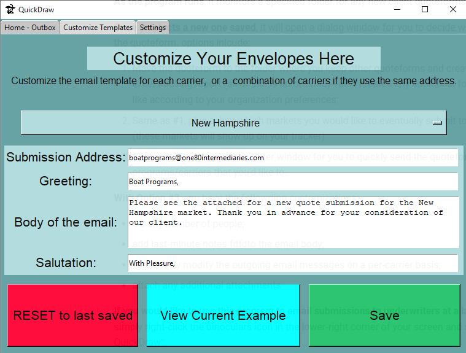
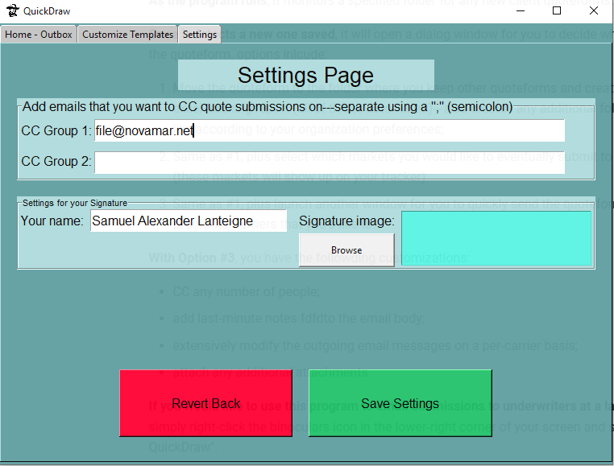

# Customization Options

## Customize Templates

You may edit any of these by selecting the drop-down box and selecting a market.

:information_source: Some of those options represent occurences where multiple markets submit to the same email address: you can edit all combinations so that you have all your bases covered regarding templates.

:warning: Viewing emails or current examples is not currently supported yet.

## Customize CC and Signature

To change the signature image (in your case, it's replacing the digitized signature), you may either click-and-drag an image onto the box or browse for a file.

:information_source: an unlimited number of CC addresses can be put on either line; both lines get combined.

