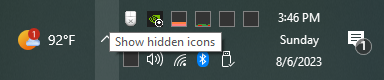
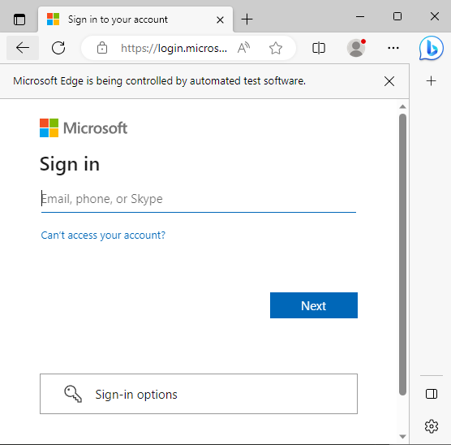
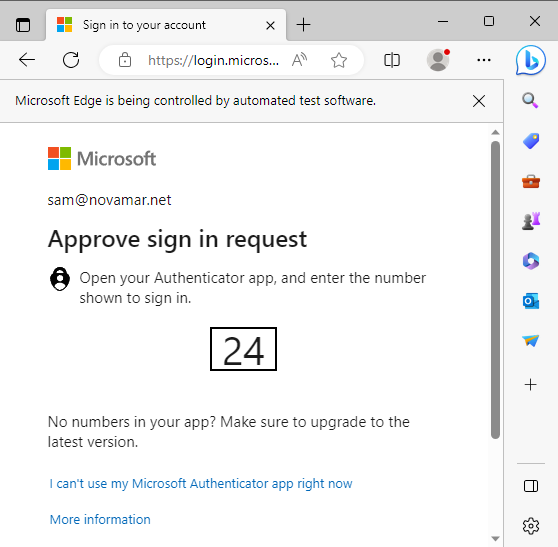
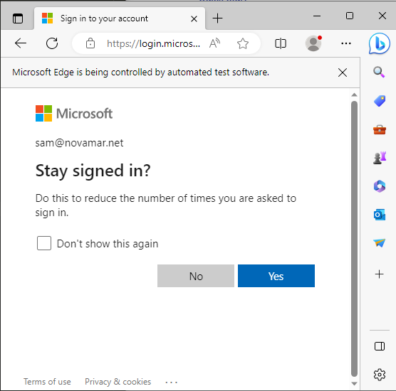

# Quick-Start

#### Running the Program

By default, the program runs upon start-up.

To confirm this, you should see this icon in the lower right-corner of your screen:

    You may need to click the upwards-arrow to expand the icons shown

**As the program runs**, it monitors a specified folder for any new client quoteforms.

**Once it detects a new one saved**, it will open a dialog window for you to decide what to do with the quoteform. options inlcude:

1. Move the quoteform to the folder where you keep other quoteforms and create an entry in an excel tracking report (all of this is automated)---also creates any additional folders that you'd like according to your organization preferences;
2. Same as #1, plus select which markets you would like to eventually submit to for this client (these markets will show up on your tracker)
3. Same as #1, plus launch another window for you to quickly send the quoteform out to any programs/carriers that you'd like to.

**With Option #3**, you have the followding customizations:

- CC any number of people;
- add last-minute notes fdfdto the email body;
- extensively modify the outgoing email messages on a per-carrier basis;
- attach any additional attachments

**If you would like to use this program to email submissions to underwriters at a later time**:

simply right-click the binoculars icon in the lower-right corner of your screen and select "Run QuickDraw".

- This will launch the main program window;
- See [Submitting to Markets](submitting.md) for how to use this window in-depth.

## Authenticate Your Account for the First Time

Once you send emails for the first time, Microsoft will ask you to login. This is to authenticate you so that you're authorized to send emails from your account _"name@novamar.net"_

Once you enter your username & password, on the next screen you _may_ see a rquest to approve the login. If you have enabled 2nd Factor Authentication on your Microsoft account, you will see this:

Depending on your settings, to confirm you may be able to:

- Use the Microsoft Authenticator App on phone/tablet/watch
- confirm an email
- confirm a text message

After the first time of doing this, the program re-authenticates itself automatically before the current permission expires.

:information_source: You will not need to do this again.

## You Don't Have to Stay Signed-in

After approving your login, if you see this screen, you do **NOT** have to stay signed in; it's a new browser session every time.

