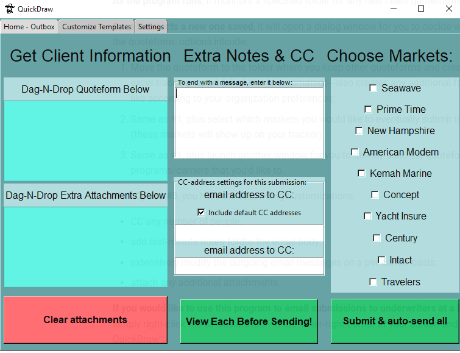

# Submitting to Markets

The main window of the program is shown below:

## Quoteform

:information_source: **Note that if this program was triggered automatically** from a new quoteform and you chose to submit to markets, the client's quoteform will already be attached and shown in the top-left-most box.

**Otherwise,** simply left-click-and-drag the quoteform onto the top-left box. Once you release the mouse button, the name of the quoteform should be shown in the box, which most likely represents the client's name (parsed from the PDF file).

You may now left-click-and-drag any other files that you would like to send underwriters (boating resumes, surveys, vessel/dock photos, etc.) onto the lower-left box.

:warning: If you click-and-drag another quoteform---or any other file---onto this top-left box, it will delete the former and replace it with the latter. **Be aware of this.**

## Select Markets

- On the right-side, select which markets that you would like to send your client into.

- More will be added upon request, just let me know.

## Last-minute Adjustments

### Quick items to note:

:information_source: **Note**: these submissions are sent with pre-existing email templates, so extra notes are not necessary for most submissions.

:information_source: **Note also**: Additionally, there are also email addresses that are "CC'd" by default...

    **cough** file@novamar.net

If you wish to edit the templates or default CC addresses---or to know more about them---please see [Configurations Options](configurations-options.md)

#### However,

In combination with the customizable templates, you may want to add last-minute notes within the email body, or include other people on the CC for a particular submission---which leads us to the next couple sections...

## Extra Notes

- You can enter any extra notes/text within the center-top box and it will be included in the email body, lastly but right before your salutation;

## Modify "CC" addresses

- Within the center-bottom section of the window, you can input any additional addresses that you'd like to CC on the outgoing submission
- If the checkbox is selected, the default "CC" addresses will be used **in addition to any that you specify here**;
- If the checkbox is **not** selected, then only the addresses specified here will be copied on the outgoing emails;

:information_source: **Note**: an unlimited number of addresses can be put here.

:warning: Please separate the emails using a semi-colon "**;**".
